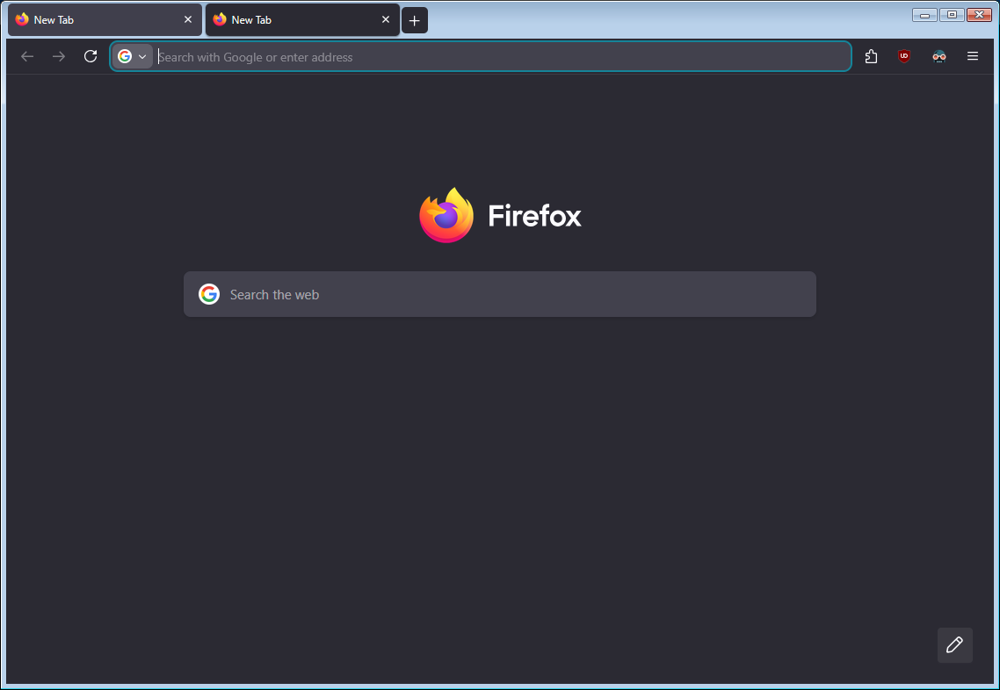

# ffbasictheme
This theme provides a near native look when used with the basic (non DWM) titlebars.

This is NOT a theme that should be used with the normal DWM titlebars, and should be used with DWM disabled or with a program that makes the basic frames render such as BasicThemer2. This theme is only meant to work at 100% scale (at other scales the titlebar and buttons appear blurry), but I might expand it to include 125% or 150%.

## Install
To install this, open about:support, open the profile folder, and copy the chrome folder into the profile folder.

If the theme doesn't apply, go to about:config and set toolkit.legacyUserProfileCustomizations.stylesheets to true.

## Screenshot

